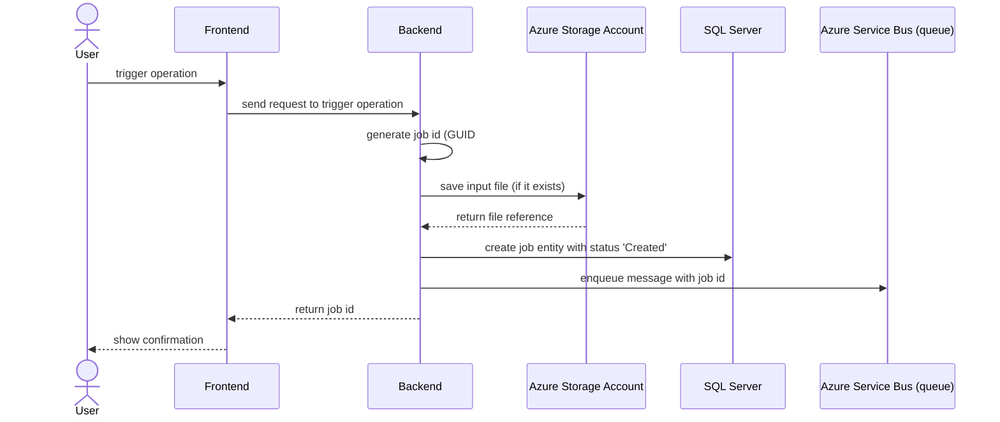
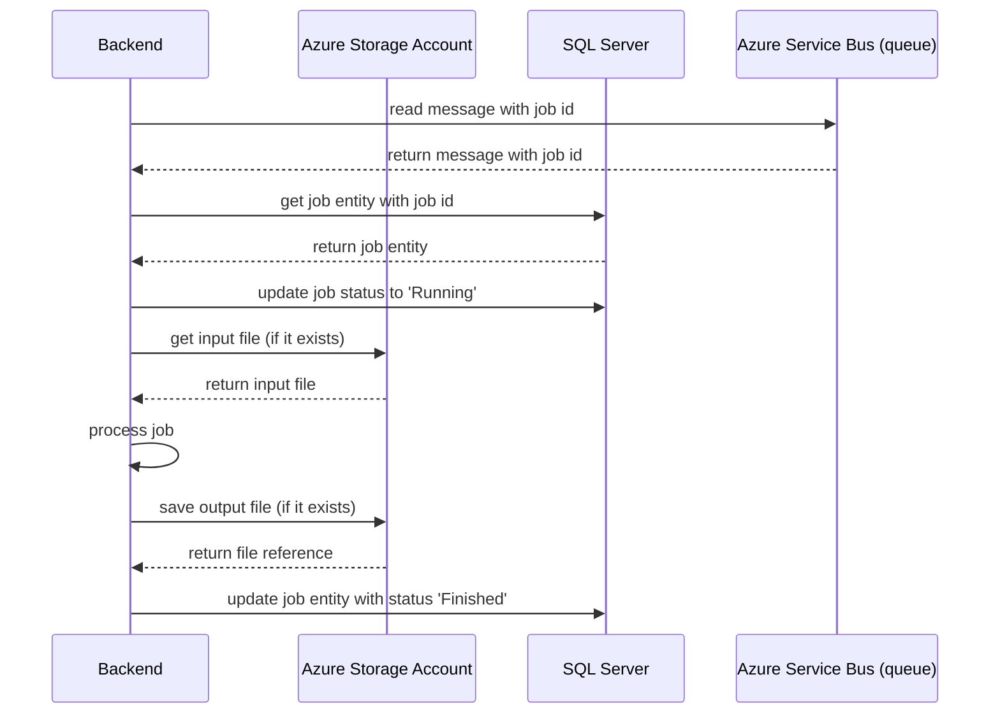
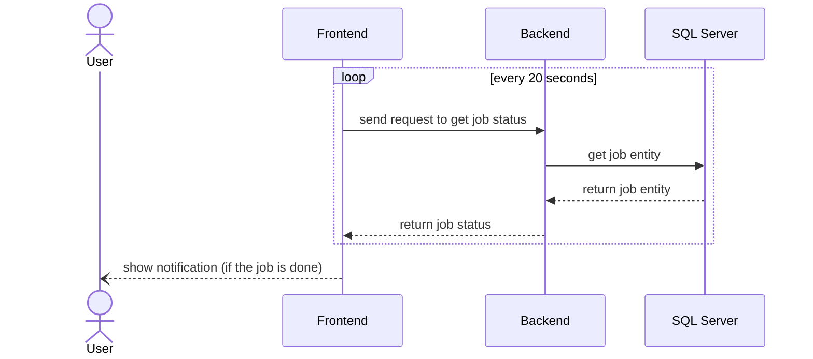

# AsyncJobsTemplate

A solution that contains a template for implementing asynchronous jobs based on a Service Bus queue, SQL Server, and Azure Storage Account.

## How Does It Work

Let's imagine that a web application allows you to generate a file based on a large dataset. We have to assume that this operation can be time-consuming and may take longer than one minute. In that case the frontend part of this application triggers a job that is being processed on the backend side. Afterward, the front end can check the job status and download the file once the job is complete.

This project presents an example implementation of a mechanism that can solve such a use case and similar ones. It allows you to implement long-running jobs that are triggered by HTTP requests. Jobs can require input data in JSON format or a file. Jobs can generate output data in JSON format and / or a file.

Web API project contains endpoints that allow you to:

- Trigger a job by sending an HTTP request with a JSON payload.
- Trigger a job by sending an HTTP request with a file.
- Get a job status.
- Get the list of jobs (it supports pagination).
- Downloading a file generated by a job.

All endpoints are secured with Microsoft Entra ID.

### Technical Details

General steps of the job processing mechanism:

1. The frontend triggers a job by sending an HTTP request to the Web API.
2. The backend generates a new job id (GUID).
3. The backend saves an input file in Azure Storage Account (if the job requires a file).
4. The backend creates a new job entity in the SQL Server database with the status set to 'Created'. The entity contains input job data and a reference to the input file (if the job requires a file).
5. The backend sends a message to the Service Bus queue with the job id.
6. The backend returns the job id to the frontend.
7. The frontend can verify the job status by sending an HTTP request to the Web API, typically in a loop with a delay between requests.
8. The backend reads the message with a job id from the Service Bus queue.
9. The backend gets the job entity from the database.
10. The backend updates the job status to 'Running'.
11. The backend gets the input file from Azure Storage Account (if the job requires a file).
12. The backend processes the job.
13. The backend saves an output file in Azure Storage Account (if the job generates a file).
14. The backend updates the job entity in the SQL Server database with the status set as 'Finished'. The entity contains output job data and / or a reference to the output file (if the job generates a file).
15. The frontend can receive output data and download the output file.

#### Triggering Operation

#### Processing Jobs

#### Getting Job Status

## How To Run It Locally

### Prerequisites

- ASP.NET Core 9
- Microsoft Entra ID tenant
- Azure Storage Account
- SQL Server 2019 or higher
- Azure Service Bus (standard tier or higher)

### Configuration

In the local environment, it's recommended to use [user secrets](https://learn.microsoft.com/en-us/aspnet/core/security/app-secrets?view=aspnetcore-9.0&tabs=windows).

1. Set up configuration for Microsoft Entra ID (`AzureAd` section).
2. Set up name for Azure Storage Account (`AzureStorageAccount:Name` section). Authorization to Azure Storage Account is based on the application with client id and client secret defined in `AzureAd` section.
3. Set up connection string to SQL Server (`SqlServer` section).
4. Set up Azure Service Bus configuration (`AzureServiceBus` section). Authorization to Azure Service Bus is based on the application with client id and client secret defined in `AzureAd` section.
5. Set up username and password for Swagger UI (`Swagger` section).
6. Set up queue type to `AzureServiceBus` (`Queue` section).

## Tests

This project uses Web API end-to-end (E2E) tests built with:

- [xUnit v2](https://xunit.net/)
- [WebApplicationFactory](https://learn.microsoft.com/en-us/aspnet/core/test/integration-tests?view=aspnetcore-9.0#basic-tests-with-the-default-webapplicationfactory)
- [TestContainers](https://testcontainers.com/)
    - [Azurite](https://testcontainers.com/modules/azurite/)
    - [MsSql](https://testcontainers.com/modules/mssql/)
- [Verify](https://github.com/VerifyTests/Verify)
- [FluentAssertions](https://github.com/fluentassertions/fluentassertions)
- [NSubstitute](https://github.com/nsubstitute/NSubstitute)

Project with tests: `AsyncJobsTemplate.WebApi.Tests.E2E`.

## Things To Implement

- [ ] Add a simple frontend application in Blazor.
- [ ] Add frontend tests in Playwright.
- [ ] Add correlation between jobs and users.
- [ ] Add load tests in Grafana K6.
- [x] Migrate to .NET 9.
- [ ] Add integration with Application Insights.
- [x] Add example of using an external API.
- [ ] Add health check.
